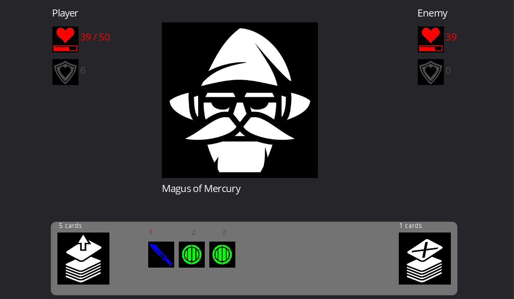
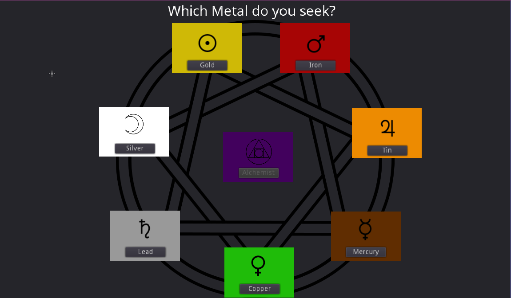
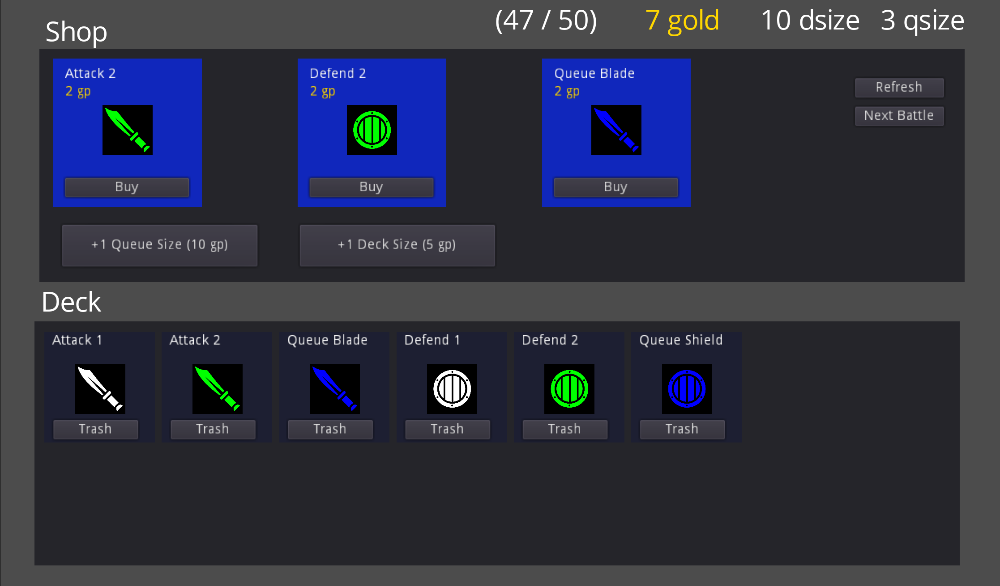

# Design Log

## April 15

- 3pm: working on clarity of "battle" scene

## April 14

- problem: if you don't have enough health, you die instantly at start of battle before there's time to build up armor
- 1130pm - winning is possible, but reasonably difficult. I won once by increaing my queue only. perhaps queue prices should increase over time?
- 330pm - added a level select screen

- 2pm - working on side effort.. event bus / event queue
  - reading: https://gameprogrammingpatterns.com/event-queue.html

## April 13

- 8pm - I notice myself looking away during battles.. since i can't act during them
- 7:30 pm - how it looks

- trying to make card choices more tactical and engaging. Adding first cards to use "queue" based mechanics.
- with the "debug deck" (1 of each card), I was able to squeak through level 4 and died immediately on level 5.

## April 12
- 11:50pm - dying consistenly on level 4.
  - seems like monster difficulty scales up too fast.
  - there's no way to heal.
- 6pm - with base HP of 99, was dying on level 6
  - some buginess with how armor worked
  - too much gold as well, need a way to spend (e.g. expand the queue)
